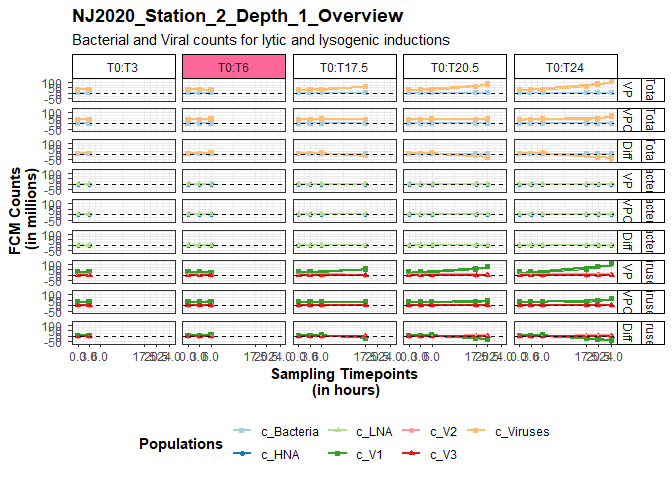
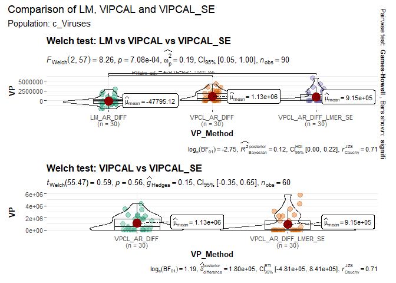

<!-- README.md is generated from README.Rmd. Please edit that file -->

# viralprod

<!-- badges: start -->

[](https://lifewatch.be)
[](https://lifecycle.r-lib.org/articles/stages.html#experimental)
<!-- badges: end -->

`viralprod` is a powerful R package designed for automating viral
production data analyses. It is a valuable tool for researchers and
marine scientists investigating marine viruses, enabling them to
calculate, analyze and visualize viral production efficiently.

You can find detailed information in the vignettes online:

- [Input data for
  viralprod](https://github.com/mdhishamshaikh/ViralProduction_R/tree/rpkg/vignettes)
- [Introduction to
  viralprod](https://github.com/mdhishamshaikh/ViralProduction_R/tree/rpkg/vignettes)

## Installation

You can install the development version of `viralprod` from
[GitHub](https://github.com/) using the following code:

``` r
# install.packages("devtools")
devtools::install_github("mdhishamshaikh/ViralProduction_R")
```

To load the package, use the following command:

``` r
library(viralprod)
```

## Getting started

The `viralprod` package simplifies the analysis of viral production
data, making it suitable for researchers studying marine viruses. To
utilize the package effectively, it’s essential to complete prior steps,
including sampling, virus reduction assay encompassing filtration and
incubation stages, and subsequent flow cytometry processing. The package
is structured around **three** fundamental steps, each contributing to a
comprehensive analysis:

- *Calculating Viral Production*: It provides two primary methods,
  `linear regression` and `VIPCAL`, for calculating viral production
  rates from viral counts.
- *Analyze Viral Production*: Various parameters for estimating
  virus-mediated microbial mortality can be determined based on the
  calculated viral production values.
- *Visualize Viral Production*: Effective data visualization plays a
  pivotal role in data analyses. The package provides illustrative
  examples to visualize your viral production data effectively.

Begin by exploring the available functions within the package. Alongside
the pipe operator from the `dplyr` package, a variety of functions are
at your disposal:

``` r
ls("package:viralprod")
#> [1] "%>%"                  "vp_analyze"           "vp_calculate"        
#> [4] "vp_check_populations" "vp_class_count_data"  "vp_class_ori_abu"    
#> [7] "vp_end_to_end"        "vp_list_of_methods"   "vp_visualize"
```

Within the package, each of the three primary steps has its own,
dedicated function. Additionally, a comprehensive wrapper function
exists, `vp_end_to_end`, which integrates all three essential steps of
viral production analyses into a single execution. Executing this
singular function yields calculated viral production results, analyzed
data, and visualizations. Below, we will demonstrate the functionality
of the wrapper function using example data available in the
`inst/extdata` folder, use of the separate main functions is integrated
in the `Introduction to viralprod` vignette.

Running the code, provided below, also serves as a convenient method to
verify the correct installation of the package. Note that the assessment
of input data frames conforms to the package’s requirements is
seamlessly integrated into the wrapper function through the
`vp_class_count_data` function.

For detailed information regarding the specific requirements for input
data, please consult the vignette: `Input data for viralprod`.
Furthermore, comprehensive insights into the methodology, including
individual function usage, will be expounded upon in
`Introduction to viralprod`.

Two input data files are required: count data from flow cytometer, the
original abundances of seawater sample. Load in example data:

``` r
data_NJ2020_all <- read.csv(system.file('extdata', 'NJ2020_Station_2_and_6_all_populations.csv', package = "viralprod"))
head(data_NJ2020_all)
#>    Sample_Name Staining_Protocol Expt_Date Date_Measurement Location
#> 1 vi201103.011           Viruses  06-08-20         03-11-20   NJ2020
#> 2 vi201103.027           Viruses  06-08-20         03-11-20   NJ2020
#> 3 vi201104.009           Viruses  06-08-20         03-11-20   NJ2020
#> 4 vi201103.013           Viruses  06-08-20         03-11-20   NJ2020
#> 5 vi201103.028           Viruses  06-08-20         03-11-20   NJ2020
#> 6 vi201104.010           Viruses  06-08-20         03-11-20   NJ2020
#>   Station_Number Depth Sample_Type Timepoint Replicate c_Bacteria       c_HNA
#> 1              2     1        0.22         0         1   2302.772    657.9348
#> 2              2     1          VP         0         1 902558.635 485109.3090
#> 3              2     1         VPC         0         1 825159.915 467213.8330
#> 4              2     1        0.22         0         2   2302.772    328.9674
#> 5              2     1          VP         0         2 857782.516 513137.7551
#> 6              2     1         VPC         0         2 770149.254 451553.3084
#>        c_LNA c_Viruses     c_V1    c_V2      c_V3        VBR HNAperLNA ...20
#> 1   1644.837  12126652 10474610 1558655  93387.35 5266.11111 0.4000000    NA
#> 2 417449.326  33939019 28626527 4623201 689291.12   37.60312 1.1620795    NA
#> 3 357946.082  36735608 31173468 4822708 739431.39   44.51938 1.3052632    NA
#> 4   1973.804  12777569 10998408 1675073 104089.08 5548.77778 0.1666667    NA
#> 5 344644.761  34344563 28800531 4845791 698240.85   40.03878 1.4888889    NA
#> 6 318595.945  34180810 28994948 4534163 651699.32   44.38206 1.4173228    NA
#>   ...21 ...22 ...23 ...24 ...25 ...26 ...27 ...28 ...29 ...30 ...31
#> 1    NA    NA    NA    NA    NA    NA    NA    NA    NA    NA    NA
#> 2    NA    NA    NA    NA    NA    NA    NA    NA    NA    NA    NA
#> 3    NA    NA    NA    NA    NA    NA    NA    NA    NA    NA    NA
#> 4    NA    NA    NA    NA    NA    NA    NA    NA    NA    NA    NA
#> 5    NA    NA    NA    NA    NA    NA    NA    NA    NA    NA    NA
#> 6    NA    NA    NA    NA    NA    NA    NA    NA    NA    NA    NA
```

``` r
str(data_NJ2020_all)
#> 'data.frame':    84 obs. of  31 variables:
#>  $ Sample_Name      : chr  "vi201103.011" "vi201103.027" "vi201104.009" "vi201103.013" ...
#>  $ Staining_Protocol: chr  "Viruses" "Viruses" "Viruses" "Viruses" ...
#>  $ Expt_Date        : chr  "06-08-20" "06-08-20" "06-08-20" "06-08-20" ...
#>  $ Date_Measurement : chr  "03-11-20" "03-11-20" "03-11-20" "03-11-20" ...
#>  $ Location         : chr  "NJ2020" "NJ2020" "NJ2020" "NJ2020" ...
#>  $ Station_Number   : int  2 2 2 2 2 2 2 2 2 2 ...
#>  $ Depth            : int  1 1 1 1 1 1 1 1 1 1 ...
#>  $ Sample_Type      : chr  "0.22" "VP" "VPC" "0.22" ...
#>  $ Timepoint        : num  0 0 0 0 0 0 0 0 0 3 ...
#>  $ Replicate        : int  1 1 1 2 2 2 3 3 3 1 ...
#>  $ c_Bacteria       : num  2303 902559 825160 2303 857783 ...
#>  $ c_HNA            : num  658 485109 467214 329 513138 ...
#>  $ c_LNA            : num  1645 417449 357946 1974 344645 ...
#>  $ c_Viruses        : num  12126652 33939019 36735608 12777569 34344563 ...
#>  $ c_V1             : num  10474610 28626527 31173468 10998408 28800531 ...
#>  $ c_V2             : num  1558655 4623201 4822708 1675073 4845791 ...
#>  $ c_V3             : num  93387 689291 739431 104089 698241 ...
#>  $ VBR              : num  5266.1 37.6 44.5 5548.8 40 ...
#>  $ HNAperLNA        : num  0.4 1.162 1.305 0.167 1.489 ...
#>  $ ...20            : logi  NA NA NA NA NA NA ...
#>  $ ...21            : logi  NA NA NA NA NA NA ...
#>  $ ...22            : logi  NA NA NA NA NA NA ...
#>  $ ...23            : logi  NA NA NA NA NA NA ...
#>  $ ...24            : logi  NA NA NA NA NA NA ...
#>  $ ...25            : logi  NA NA NA NA NA NA ...
#>  $ ...26            : logi  NA NA NA NA NA NA ...
#>  $ ...27            : logi  NA NA NA NA NA NA ...
#>  $ ...28            : logi  NA NA NA NA NA NA ...
#>  $ ...29            : logi  NA NA NA NA NA NA ...
#>  $ ...30            : logi  NA NA NA NA NA NA ...
#>  $ ...31            : logi  NA NA NA NA NA NA ...
```

``` r
NJ2020_original_abundances <- read.csv(system.file('extdata','NJ2020_original_abundances.csv', package = "viralprod"))
NJ2020_original_abundances
#>   ...1 Location Bacterial_Sample_Name Viral_Sample_Name Station_Number
#> 1    1   NJ2020          BA210507.066      VI210507.067              1
#> 2    2   NJ2020          BA210507.067      VI210507.068              2
#> 3    3   NJ2020          BA210507.068      VI210507.069              3
#> 4    4   NJ2020          ba201028.015      vi201028.008              4
#> 5    5   NJ2020          BA210507.069      VI210507.070              5
#> 6    6   NJ2020          BA210507.070      VI210507.071              6
#> 7    7   NJ2020          BA210507.071      VI210507.072              7
#>   Expt_Date Total_Bacteria     HNA     LNA Total_Viruses        V1       V2
#> 1  04-08-20        3454942 1993730 1461212     182285832 140810685 33328040
#> 2  06-08-20        3231054 2038118 1192936     204686985 161552701 34950478
#> 3  18-08-20        6665980 3740874 2925106     226495058 191800795 26766127
#> 4  20-08-20        8163509 3911664 4251845     183418451 153581030 22152025
#> 5  01-09-20        3297776 1775346 1522430     137359967 111715891 22360925
#> 6  03-09-20        4702883 2332421 2370463     153088962 122845569 25154253
#> 7  05-09-20        3599259 1837173 1762086     133369028 107261386 22336907
#>        V3      VBR Latitude Longitude
#> 1 8147107 52.76089 53.00177  4.789015
#> 2 8183806 63.34990 53.00177  4.789015
#> 3 7928136 33.97776 53.00177  4.789015
#> 4 7685396 22.46809 53.00177  4.789015
#> 5 3283152 41.65230 53.00177  4.789015
#> 6 5089140 32.55215 53.00177  4.789015
#> 7 3770735 37.05458 53.00177  4.789015
```

``` r
str(NJ2020_original_abundances)
#> 'data.frame':    7 obs. of  16 variables:
#>  $ ...1                 : int  1 2 3 4 5 6 7
#>  $ Location             : chr  "NJ2020" "NJ2020" "NJ2020" "NJ2020" ...
#>  $ Bacterial_Sample_Name: chr  "BA210507.066" "BA210507.067" "BA210507.068" "ba201028.015" ...
#>  $ Viral_Sample_Name    : chr  "VI210507.067" "VI210507.068" "VI210507.069" "vi201028.008" ...
#>  $ Station_Number       : int  1 2 3 4 5 6 7
#>  $ Expt_Date            : chr  "04-08-20" "06-08-20" "18-08-20" "20-08-20" ...
#>  $ Total_Bacteria       : num  3454942 3231054 6665980 8163509 3297776 ...
#>  $ HNA                  : num  1993730 2038118 3740874 3911664 1775346 ...
#>  $ LNA                  : num  1461212 1192936 2925106 4251845 1522430 ...
#>  $ Total_Viruses        : num  1.82e+08 2.05e+08 2.26e+08 1.83e+08 1.37e+08 ...
#>  $ V1                   : num  1.41e+08 1.62e+08 1.92e+08 1.54e+08 1.12e+08 ...
#>  $ V2                   : num  33328040 34950478 26766127 22152025 22360925 ...
#>  $ V3                   : num  8147107 8183806 7928136 7685396 3283152 ...
#>  $ VBR                  : num  52.8 63.3 34 22.5 41.7 ...
#>  $ Latitude             : num  53 53 53 53 53 ...
#>  $ Longitude            : num  4.79 4.79 4.79 4.79 4.79 ...
```

## Package’s usage

Before executing the comprehensive wrapper function, let’s take a look
at all the different arguments:

``` r
args(vp_end_to_end)
#> function (data = data.frame(), original_abundances = data.frame(), 
#>     methods = c(1:12), SR_calc = TRUE, BP_endpoint = TRUE, burst_sizes = c(), 
#>     bacterial_secondary_production = NULL, nutrient_content_bacteria = list(), 
#>     nutrient_content_viruses = list(), write_output = TRUE, output_dir = "") 
#> NULL
```

In the initial stages of the wrapper function, both input data frames
undergo a thorough examination to ensure they conform to the required
format. Subsequently, we encounter the `methods` parameter, which
governs the selection of algorithmic variants of `linear regression` and
`VIPCAL` for the calculation of viral production rates. As a user, you
have the flexibility to execute all available variants or opt for a
subset, among the prominent methods are:

- Method **4**: vp_linear_average_replicates_diff.
- Method **9**: vp_VIPCAL_average_replicates_diff.
- Method **12**: vp_VIPCAL_average_replicates_diff_LMER_SE.

Furthermore, the wrapper function offers a range of supplementary
parameters. In the absence of user-defined values, default settings
defined within the function, are automatically applied. Notably, the
package incorporates a dedicated function designed to generate a
comprehensive list of available variants for viral production
calculation in the global environment.

``` r
vp_list_of_methods()
names(list_of_methods)
#>  [1] "vp_linear_allpoints"                      
#>  [2] "vp_linear_separate_replicates"            
#>  [3] "vp_linear_average_replicates"             
#>  [4] "vp_linear_average_replicates_diff"        
#>  [5] "vp_linear_average_replicates_diff_LMER"   
#>  [6] "vp_VIPCAL_separate_replicates"            
#>  [7] "vp_VIPCAL_average_replicates"             
#>  [8] "vp_VIPCAL_average_replicates_SE"          
#>  [9] "vp_VIPCAL_average_replicates_diff"        
#> [10] "vp_VIPCAL_average_replicates_diff_SE"     
#> [11] "vp_VIPCAL_average_replicates_diff_LMER"   
#> [12] "vp_VIPCAL_average_replicates_diff_LMER_SE"
```

For example, consider a closer look at method **12**:

``` r
list_of_methods[12]
#> $vp_VIPCAL_average_replicates_diff_LMER_SE
#> function (data) 
#> {
#>     separate_replicate_dataframe_with_timepoints <- vp_separate_replicate_dataframe(data)
#>     determine_viral_production_dataframe <- determine_vp_VIPCAL_LMER_model_SE(separate_replicate_dataframe_with_timepoints)
#>     viral_production_VIPCAL <- determine_viral_production_dataframe %>% 
#>         dplyr::group_by(.data$tag, .data$Time_Range, .data$Population, 
#>             .data$Sample_Type) %>% dplyr::arrange("tag", factor(.data$Sample_Type, 
#>         levels = c("VP", "VPC", "Diff")), factor(.data$Population, 
#>         levels = .GlobalEnv$populations_to_analyze[grep("c_V", 
#>             .GlobalEnv$populations_to_analyze)])) %>% dplyr::mutate(VP_Method = "VPCL_AR_DIFF_LMER_SE") %>% 
#>         dplyr::select("tag", "Location", "Station_Number", "Depth", 
#>             dplyr::everything())
#>     return(viral_production_VIPCAL)
#> }
#> <bytecode: 0x000002b83158a728>
#> <environment: namespace:viralprod>
```

Now, it’s time to execute the wrapper function. Although the following
demonstration uses example data, it’s essential to note that executing
this function can serve as a convenient method to verify the correct
installation of the package. Since this is for illustration purposes, no
output files will be written. If `write_output` is set to `TRUE`, ensure
to specify the output directory where the results should be stored. All
output data frames and a list containing various visualizations will
become available in the global environment.

``` r
# All methods will be executed with default parameters
vp_end_to_end(data = data_NJ2020_all,
              original_abundances = NJ2020_original_abundances,
              methods = c(1:12),
              SR_calc = TRUE,
              BP_endpoint = TRUE,
              burst_sizes = c(),
              bacterial_secondary_production = NULL,
              nutrient_content_bacteria = list(),
              nutrient_content_viruses = list(),
              write_output = FALSE,
              output_dir = "")
#> [1] "Following populations will be analyzed: c_Bacteria, c_HNA, c_LNA, c_Viruses, c_V1, c_V2, c_V3"
#> [1] "Following populations will be analyzed: c_Bacteria, c_HNA, c_LNA, c_Viruses, c_V1, c_V2, c_V3"
#> [1] "Processing using method: vp_linear_allpoints"
#> [1] "Analysis done for method vp_linear_allpoints. Please check calc_vp_error_list and calc_vp_warn_list for any error or warnings."
#> [1] "Processing using method: vp_linear_separate_replicates"
#> [1] "Analysis done for method vp_linear_separate_replicates. Please check calc_vp_error_list and calc_vp_warn_list for any error or warnings."
#> [1] "Processing using method: vp_linear_average_replicates"
#> [1] "Analysis done for method vp_linear_average_replicates. Please check calc_vp_error_list and calc_vp_warn_list for any error or warnings."
#> [1] "Processing using method: vp_linear_average_replicates_diff"
#> [1] "Analysis done for method vp_linear_average_replicates_diff. Please check calc_vp_error_list and calc_vp_warn_list for any error or warnings."
#> [1] "Processing using method: vp_linear_average_replicates_diff_LMER"
#> [1] "Analysis done for method vp_linear_average_replicates_diff_LMER. Please check calc_vp_error_list and calc_vp_warn_list for any error or warnings."
#> [1] "Processing using method: vp_VIPCAL_separate_replicates"
#> [1] "Analysis done for method vp_VIPCAL_separate_replicates. Please check calc_vp_error_list and calc_vp_warn_list for any error or warnings."
#> [1] "Processing using method: vp_VIPCAL_average_replicates"
#> [1] "Analysis done for method vp_VIPCAL_average_replicates. Please check calc_vp_error_list and calc_vp_warn_list for any error or warnings."
#> [1] "Processing using method: vp_VIPCAL_average_replicates_SE"
#> [1] "Analysis done for method vp_VIPCAL_average_replicates_SE. Please check calc_vp_error_list and calc_vp_warn_list for any error or warnings."
#> [1] "Processing using method: vp_VIPCAL_average_replicates_diff"
#> [1] "Analysis done for method vp_VIPCAL_average_replicates_diff. Please check calc_vp_error_list and calc_vp_warn_list for any error or warnings."
#> [1] "Processing using method: vp_VIPCAL_average_replicates_diff_SE"
#> [1] "Analysis done for method vp_VIPCAL_average_replicates_diff_SE. Please check calc_vp_error_list and calc_vp_warn_list for any error or warnings."
#> [1] "Processing using method: vp_VIPCAL_average_replicates_diff_LMER"
#> [1] "Analysis done for method vp_VIPCAL_average_replicates_diff_LMER. Please check calc_vp_error_list and calc_vp_warn_list for any error or warnings."
#> [1] "Processing using method: vp_VIPCAL_average_replicates_diff_LMER_SE"
#> [1] "Analysis done for method vp_VIPCAL_average_replicates_diff_LMER_SE. Please check calc_vp_error_list and calc_vp_warn_list for any error or warnings."
#> [1] "Processing using method: vp_linear_separate_replicates, only separate replicate results"
#> [1] "Analysis done for method vp_linear_separate_replicates. Please check calc_vp_error_list and calc_vp_warn_list for any error or warnings."
#> [1] "Processing using method: vp_VIPCAL_separate_replicates, only separate replicate results"
#> [1] "Analysis done for method vp_VIPCAL_separate_replicates. Please check calc_vp_error_list and calc_vp_warn_list for any error or warnings."
#> [1] "Default values used for burst size!"
#> [1] "Default value used for bacterial secondary production!"
#> [1] "Default values used for nutrient content of bacteria!"
#> [1] "Default values used for nutrient condent of viruses!"
#> [1] "Default values used for burst size!"
#> [1] "Default value used for bacterial secondary production!"
#> [1] "Default values used for nutrient content of bacteria!"
#> [1] "Default values used for nutrient condent of viruses!"
#> [1] "Default values used for burst size!"
#> [1] "Default value used for bacterial secondary production!"
#> [1] "Default values used for nutrient content of bacteria!"
#> [1] "Default values used for nutrient condent of viruses!"
```

After running the wrapper function, check the global environment to
access its output:

``` r
ls()
#>  [1] "analyzed_vp_results_df"         "analyzed_vp_results_dictionary"
#>  [3] "calc_vp_error_list"             "calc_vp_warn_list"             
#>  [5] "data_NJ2020_all"                "list_of_methods"               
#>  [7] "NJ2020_original_abundances"     "plot_list"                     
#>  [9] "populations_to_analyze"         "vp_results_output_BP_df"       
#> [11] "vp_results_output_df"           "vp_results_output_SR_df"       
#> [13] "vp_results_output_T24_df"
```

The `calculation` step provides by default four data frames:

- *vp_results_output_df* contains the viral production results for all
  samples.
- *vp_results_output_T24_df* contains the viral production results for
  all samples at the end of the assay.
- *vp_results_output_SR_df* contains the viral production results of the
  separate replicate treatment, no averaging over replicates.
- *vp_results_output_BP_df* contains the viral production results for
  all samples with the bacterial endpoint taken into account.

``` r
head(vp_results_output_df)
#>   Location Station_Number Depth Time_Range Population Sample_Type        VP
#> 1   NJ2020              2     1      T0_T3  c_Viruses          VP -864818.8
#> 2   NJ2020              2     1      T0_T6  c_Viruses          VP -800817.3
#> 3   NJ2020              2     1   T0_T17.5  c_Viruses          VP 1551505.8
#> 4   NJ2020              2     1   T0_T20.5  c_Viruses          VP 2223299.7
#> 5   NJ2020              2     1     T0_T24  c_Viruses          VP 2899833.4
#> 6   NJ2020              6     1      T0_T3  c_Viruses          VP -170717.8
#>       abs_VP     VP_SE VP_R_Squared    VP_Method
#> 1 -2594456.3  50303.36   0.98664740 LM_ALLPOINTS
#> 2 -4804904.1  70874.29   0.94802116 LM_ALLPOINTS
#> 3 27151351.0 313474.82   0.71011430 LM_ALLPOINTS
#> 4 45577643.0 395260.81   0.70877756 LM_ALLPOINTS
#> 5 69596000.7 458625.48   0.71417750 LM_ALLPOINTS
#> 6  -512153.5 396013.09   0.04439726 LM_ALLPOINTS
```

The `analyze` step enhances the viral production results by adding
various parameters to estimate virus-mediated microbial mortality. An
additional data frame provides descriptions and units for each variable.

``` r
str(analyzed_vp_results_df)
#> 'data.frame':    288 obs. of  51 variables:
#>  $ Location        : chr  "NJ2020" "NJ2020" "NJ2020" "NJ2020" ...
#>  $ Station_Number  : int  2 6 2 6 2 6 2 6 2 6 ...
#>  $ Depth           : int  1 1 1 1 1 1 1 1 1 1 ...
#>  $ Time_Range      : chr  "T0_T24" "T0_T24" "T0_T24" "T0_T24" ...
#>  $ Population      : chr  "c_Viruses" "c_Viruses" "c_Viruses" "c_Viruses" ...
#>  $ Sample_Type     : chr  "VP" "VP" "VP" "VP" ...
#>  $ VP              : num  2899833 -134616 2899833 -134616 2899833 ...
#>  $ abs_VP          : num  69596001 -3230789 69596001 -3230789 69596001 ...
#>  $ VP_SE           : num  458625 127765 693869 44049 592214 ...
#>  $ VP_R_Squared    : num  0.7142 0.0649 0.8514 0.3284 0.857 ...
#>  $ VP_Method       : chr  "LM_ALLPOINTS" "LM_ALLPOINTS" "LM_SR_AVG" "LM_SR_AVG" ...
#>  $ B_0             : num  856930 1258635 856930 1258635 856930 ...
#>  $ B_OS            : num  3231054 4702883 3231054 4702883 3231054 ...
#>  $ V_OS            : num  2.05e+08 1.53e+08 2.05e+08 1.53e+08 2.05e+08 ...
#>  $ c_VP            : num  10933826 -502993 10933826 -502993 10933826 ...
#>  $ c_abs_VP        : num  262411815 -12071822 262411815 -12071822 262411815 ...
#>  $ c_VP_SE         : num  1729248 477393 2616233 164588 2232943 ...
#>  $ P_Cells_BS_10   : num  3062.2 -95.9 3062.2 -95.9 3062.2 ...
#>  $ Rate_BS_10      : num  1093383 -50299 1093383 -50299 1093383 ...
#>  $ P_BP_Lysed_BS_10: num  405 -18.6 405 -18.6 405 ...
#>  $ P_B_Loss_BS_10  : num  812.2 -25.7 812.2 -25.7 812.2 ...
#>  $ P_Cells_BS_25   : num  1224.9 -38.4 1224.9 -38.4 1224.9 ...
#>  $ Rate_BS_25      : num  437353 -20120 437353 -20120 437353 ...
#>  $ P_BP_Lysed_BS_25: num  161.98 -7.45 161.98 -7.45 161.98 ...
#>  $ P_B_Loss_BS_25  : num  324.9 -10.3 324.9 -10.3 324.9 ...
#>  $ P_Cells_BS_40   : num  766 -24 766 -24 766 ...
#>  $ Rate_BS_40      : num  273346 -12575 273346 -12575 273346 ...
#>  $ P_BP_Lysed_BS_40: num  101.24 -4.66 101.24 -4.66 101.24 ...
#>  $ P_B_Loss_BS_40  : num  203.04 -6.42 203.04 -6.42 203.04 ...
#>  $ V_TT            : num  0.05342 -0.00329 0.05342 -0.00329 0.05342 ...
#>  $ DOC_V           : num  3.63e-10 -1.67e-11 3.63e-10 -1.67e-11 3.63e-10 ...
#>  $ DON_V           : num  1.43e-10 -6.59e-12 1.43e-10 -6.59e-12 1.43e-10 ...
#>  $ DOP_V           : num  5.20e-11 -2.39e-12 5.20e-11 -2.39e-12 5.20e-11 ...
#>  $ DOC_B_BS_10     : num  2.08e-08 -9.56e-10 2.08e-08 -9.56e-10 2.08e-08 ...
#>  $ Total_DOC_BS_10 : num  2.11e-08 -9.72e-10 2.11e-08 -9.72e-10 2.11e-08 ...
#>  $ DON_B_BS_10     : num  5.47e-09 -2.51e-10 5.47e-09 -2.51e-10 5.47e-09 ...
#>  $ Total_DON_BS_10 : num  5.61e-09 -2.58e-10 5.61e-09 -2.58e-10 5.61e-09 ...
#>  $ DOP_B_BS_10     : num  8.75e-10 -4.02e-11 8.75e-10 -4.02e-11 8.75e-10 ...
#>  $ Total_DOP_BS_10 : num  9.27e-10 -4.26e-11 9.27e-10 -4.26e-11 9.27e-10 ...
#>  $ DOC_B_BS_25     : num  8.31e-09 -3.82e-10 8.31e-09 -3.82e-10 8.31e-09 ...
#>  $ Total_DOC_BS_25 : num  8.67e-09 -3.99e-10 8.67e-09 -3.99e-10 8.67e-09 ...
#>  $ DON_B_BS_25     : num  2.19e-09 -1.01e-10 2.19e-09 -1.01e-10 2.19e-09 ...
#>  $ Total_DON_BS_25 : num  2.33e-09 -1.07e-10 2.33e-09 -1.07e-10 2.33e-09 ...
#>  $ DOP_B_BS_25     : num  3.50e-10 -1.61e-11 3.50e-10 -1.61e-11 3.50e-10 ...
#>  $ Total_DOP_BS_25 : num  4.02e-10 -1.85e-11 4.02e-10 -1.85e-11 4.02e-10 ...
#>  $ DOC_B_BS_40     : num  5.19e-09 -2.39e-10 5.19e-09 -2.39e-10 5.19e-09 ...
#>  $ Total_DOC_BS_40 : num  5.56e-09 -2.56e-10 5.56e-09 -2.56e-10 5.56e-09 ...
#>  $ DON_B_BS_40     : num  1.37e-09 -6.29e-11 1.37e-09 -6.29e-11 1.37e-09 ...
#>  $ Total_DON_BS_40 : num  1.51e-09 -6.95e-11 1.51e-09 -6.95e-11 1.51e-09 ...
#>  $ DOP_B_BS_40     : num  2.19e-10 -1.01e-11 2.19e-10 -1.01e-11 2.19e-10 ...
#>  $ Total_DOP_BS_40 : num  2.71e-10 -1.25e-11 2.71e-10 -1.25e-11 2.71e-10 ...
```

``` r
analyzed_vp_results_dictionary
#>            Variable                            Unit
#> 1          Location                               /
#> 2    Station_Number                               /
#> 3             Depth                               m
#> 4        Time_Range                               h
#> 5        Population                               /
#> 6       Sample_Type                               /
#> 7                VP #VLP (virus-like particles)/mLh
#> 8            abs_VP                         #VLP/mL
#> 9             VP_SE                               /
#> 10     VP_R_Squared                               /
#> 11        VP_Method                               /
#> 12              B_0                    #bacteria/mL
#> 13             B_OS                    #bacteria/mL
#> 14             V_OS                     #viruses/mL
#> 15             c_VP                        #VLP/mLh
#> 16         c_abs_VP                         #VLP/mL
#> 17          c_VP_SE                               /
#> 18    P_Cells_BS_10                               %
#> 19       Rate_BS_10                        #VLP/mLh
#> 20 P_BP_Lysed_BS_10                               %
#> 21   P_B_Loss_BS_10                               %
#> 22    P_Cells_BS_25                               %
#> 23       Rate_BS_25                        #VLP/mLh
#> 24 P_BP_Lysed_BS_25                               %
#> 25   P_B_Loss_BS_25                               %
#> 26    P_Cells_BS_40                               %
#> 27       Rate_BS_40                        #VLP/mLh
#> 28 P_BP_Lysed_BS_40                               %
#> 29   P_B_Loss_BS_40                               %
#> 30             V_TT                             1/h
#> 31            DOC_V                         g C/mLh
#> 32            DON_V                         g N/mLh
#> 33            DOP_V                         g P/mLh
#> 34      DOC_B_BS_10                         g C/mLh
#> 35  Total_DOC_BS_10                         g C/mLh
#> 36      DON_B_BS_10                         g N/mLh
#> 37  Total_DON_BS_10                         g N/mLh
#> 38      DOP_B_BS_10                         g P/mLh
#> 39  Total_DOP_BS_10                         g P/mLh
#> 40      DOC_B_BS_25                         g C/mLh
#> 41  Total_DOC_BS_25                         g C/mLh
#> 42      DON_B_BS_25                         g N/mLh
#> 43  Total_DON_BS_25                         g N/mLh
#> 44      DOP_B_BS_25                         g P/mLh
#> 45  Total_DOP_BS_25                         g P/mLh
#> 46      DOC_B_BS_40                         g C/mLh
#> 47  Total_DOC_BS_40                         g C/mLh
#> 48      DON_B_BS_40                         g N/mLh
#> 49  Total_DON_BS_40                         g N/mLh
#> 50      DOP_B_BS_40                         g P/mLh
#> 51  Total_DOP_BS_40                         g P/mLh
#>                                                                                                                  Description
#> 1                                                                                                 Location of the experiment
#> 2                                                                            Number of station where experiment is conducted
#> 3                                                                                     Depth at which experiment is performed
#> 4               Timepoints of sampling data, expressed in a time range: starting at T = 0 until time of measuring X => T0_TX
#> 5        Population Types: c_Viruses covers the entire virus population, while c_V1, c_V2, and c_V3 represent subpopulations
#> 6                            Sample Types: VP rfor lytic viral production, Diff for lysogenic viral production, VPC for both
#> 7                                        Viral production rate: the mean viral production rate during the current Time_Range
#> 8                                                                             Absolute viral production at current timepoint
#> 9                                                                            The standard error on the viral production rate
#> 10                                                           R-squared value: goodness of fit of the linear regression model
#> 11                                                                                    Calculation method of viral production
#> 12                                                               Bacterial abundance at the beginning of the experiment (T0)
#> 13                                                                                Bacterial abundance in the original sample
#> 14                                                                                    Viral abundance in the original sample
#> 15                                             Corrected viral production rate: viral production rate in the original sample
#> 16                                     Corrected absolute viral production: absolute viral production in the original sample
#> 17                                                                     Corrected standard error on the viral production rate
#> 18   Percentage of cells for given burst size: % lytically infected cells for VP samples, % lysogenic cells for Diff samples
#> 19 Rate of bacteria for given burst size: lysis rate of bacteria for VP samples, lysogenic rate of bacteria for Diff samples
#> 20                          Percentage of bacterial production lysed: the quantity of bacterial biomass that undergoes lysis
#> 21                           Percentage of bacterial loss per day: the rate at which bacteria are removed due to viral lysis
#> 22   Percentage of cells for given burst size: % lytically infected cells for VP samples, % lysogenic cells for Diff samples
#> 23 Rate of bacteria for given burst size: lysis rate of bacteria for VP samples, lysogenic rate of bacteria for Diff samples
#> 24                          Percentage of bacterial production lysed: the quantity of bacterial biomass that undergoes lysis
#> 25                           Percentage of bacterial loss per day: the rate at which bacteria are removed due to viral lysis
#> 26   Percentage of cells for given burst size: % lytically infected cells for VP samples, % lysogenic cells for Diff samples
#> 27 Rate of bacteria for given burst size: lysis rate of bacteria for VP samples, lysogenic rate of bacteria for Diff samples
#> 28                          Percentage of bacterial production lysed: the quantity of bacterial biomass that undergoes lysis
#> 29                           Percentage of bacterial loss per day: the rate at which bacteria are removed due to viral lysis
#> 30                                         Viral turnover time: time to replacte the current virus population by new viruses
#> 31                                                                               Dissolved organic carbon release of viruses
#> 32                                                                             Dissolved organic nitrogen release of viruses
#> 33                                                                           Dissolved organic phosphorus release of viruses
#> 34                                                         Dissolved organic carbon release of bacteria for given burst size
#> 35                                                               Total dissolved organic carbon release for given burst size
#> 36                                                       Dissolved organic nitrogen release of bacteria for given burst size
#> 37                                                             Total dissolved organic nitrogen release for given burst size
#> 38                                                     Dissolved organic phosphorus release of bacteria for given burst size
#> 39                                               Total dissolved organic phosphorus release of bacteria for given burst size
#> 40                                                         Dissolved organic carbon release of bacteria for given burst size
#> 41                                                               Total dissolved organic carbon release for given burst size
#> 42                                                       Dissolved organic nitrogen release of bacteria for given burst size
#> 43                                                             Total dissolved organic nitrogen release for given burst size
#> 44                                                     Dissolved organic phosphorus release of bacteria for given burst size
#> 45                                               Total dissolved organic phosphorus release of bacteria for given burst size
#> 46                                                         Dissolved organic carbon release of bacteria for given burst size
#> 47                                                               Total dissolved organic carbon release for given burst size
#> 48                                                       Dissolved organic nitrogen release of bacteria for given burst size
#> 49                                                             Total dissolved organic nitrogen release for given burst size
#> 50                                                     Dissolved organic phosphorus release of bacteria for given burst size
#> 51                                               Total dissolved organic phosphorus release of bacteria for given burst size
```

The `visualize` step generates a list of plot objects. The package
offers eight different ways to visualize the original viral count data,
calculated viral production data, or analyzed viral production data.

``` r
names(plot_list)
#>  [1] "NJ2020_Station_2_Depth_1_Overview"       
#>  [2] "NJ2020_Station_6_Depth_1_Overview"       
#>  [3] "NJ2020_Collision_Rates"                  
#>  [4] "NJ2020_Comparison_Linear_Methods"        
#>  [5] "NJ2020_Comparison_VIPCAL_Methods"        
#>  [6] "NJ2020_Comparison_LM_VIPCAL_VIPCAL_SE"   
#>  [7] "NJ2020_Comparison_ALL"                   
#>  [8] "NJ2020_Comparison_VIPCAL_VIPCAL_SE"      
#>  [9] "NJ2020_Comparison_VIPCAL_VIPCAL_SE_ROGME"
#> [10] "NJ2020_Percentage_Cells"                 
#> [11] "NJ2020_Total_Nutrient_Release"
```

For instance, let’s start with an overview of the count data of Station
2 for each sample type. The bacterial endpoint for this assay is
highlighted in pink. It’s worth noting that stopping the assay at this
point is advisable to prevent an increase in collision rates in VP
samples, which may result in higher-than-expected lytic viral
production.

``` r
grid::grid.draw(plot_list[[1]]$plot_object)
```



Additionally, the package provides multiple ways for calculating viral
production. While `linear regression` uses the slope between the count
data, `VIPCAL` looks at the average of increments to determine viral
production. `VIPCAL-SE` takes it a step further by considering standard
errors, ensuring that only true increments are used for calculation. As
shown in the figures, `VIPCAL` may overestimate viral production, while
`VIPCAL-SE` tends to be more conservative.

``` r
plot_list[[6]]$plot_object
```



``` r
plot_list[[9]]$plot_object
```


One of the analyzed variables considers the nutrient release from
bacteria and viruses, mapping the total nutrient release in the sample
at the end of the assay.

``` r
plot_list[[11]]$plot_object
```


Now that you have explored the available functions and the wrapper
function, you are ready to harness the full potential of the `viralprod`
package for your own viral production data analysis. A more detailed and
comprehensive tutorial on the package’s functionality and usage, can be
found in the `Introduction to viralprod` vignette. This vignette
provides in-depth insights into various underlying methods and features
of the package, enabling you to leverage the package’s capabilities
effectively.

## License

MIT. See `LICENSE.md`

This software is developed for scientific, educational and research
purposes. It is not meant to be used for legal or economical purposes.
