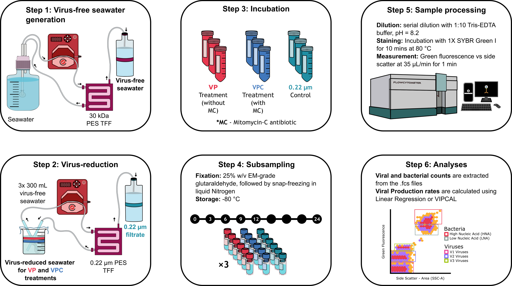
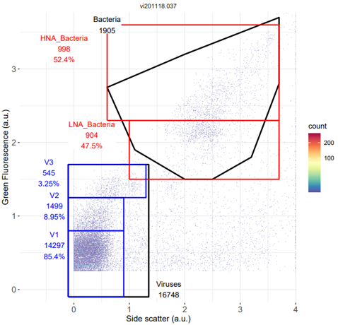
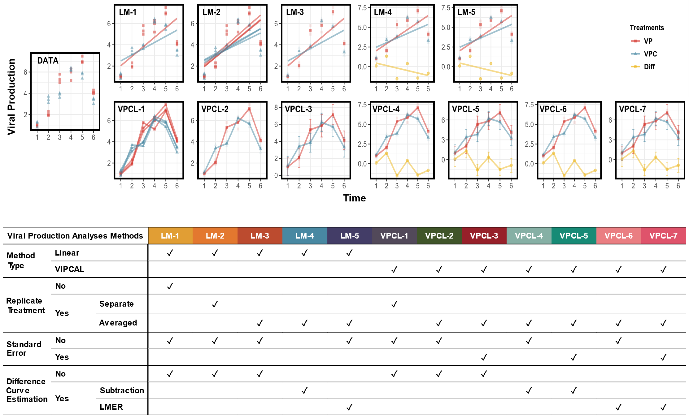

```{r, include = FALSE}
knitr::opts_chunk$set(
  collapse = TRUE,
  comment = "#>",
  fig.align = "center",
  out.width = "75%"
)
```

The `viralprod` package operates as an automated pipeline for comprehensive viral production data analyses. This versatile tool streamlines the entire process into three key steps: 

* *Calculating Viral Production*: Viral production is calculated by two primary methods: `linear regression` and `VIPCAL`.
* *Analyze Viral Production*: Determination of various parameters for estimating virus-mediated microbial mortality.
* *Visualize Viral Production*: Illustrative examples to visualize the original viral count data, calculated viral production data, or analyzed viral production data.

Before delving into the package, it is imperative to conduct a series of essential preliminary steps. These preparatory measures encompasses wet-lab procedures, including sampling, virus reduction assay that includes filtration and incubation stages, and the subsequent flow cytometry analyses. This vignette offers invaluable insights and guidance to gain a deeper understanding of these critical preparatory procedures as well as a comprehensive guide on effectively utilizing the package's functions.

## Preliminary steps

In the following sections, we will embark on an in-depth exploration of each of these preliminary stages to provide a more profound understanding of their significance and optimal execution. These steps, integral to the wet-lab domain, request careful performance as they substantially can influence the quality of subsequent calculations and analyses.

### Viral Reduction Assay

The primary objective of this package is the precise estimation of viral production within natural aquatic environments. Marine viruses represent a prolific component of the marine ecosystem, with their interactions they can potentially deploy effects on phyto- and bacterioplankton populations, thereby influencing its composition and the microbial biomass release into the aquatic milieu. Viral production, in this context, is defined as the quantity of viruses generated within a specified time frame and volume. 

Upon the collection of seawater samples, the viral reduction assay starts by employing a `tangential flow diafiltration (TFD)` dilution method. TFD is the preferred method over conventional `vacuum diafiltration` methodologies due to its enhanced bacterial recovery and  viral dilution capabilities. Nevertheless, both methods share the advantage of enabling direct observation of viral production with use of only a single correction factor being the bacterial loss from the original sample compared to the concentrate following filtration (Winget et al., 2005).

In practical terms, the filtration procedure entails subjecting the original seawater samples to two consecutive TFD filtrations (Figure 1: Step 1 & 2). A 30 kDA PES filter is initially employed to obtain what is referred to as `virus-free seawater`. This resulting filtrate serves as the flushing volume for the second filtration. The second filtration employs a 0.22 $\mu$m PES filter, wherein back pressure within the filter cartridge propels water and particles smaller than 0.22 $\mu$m (such as viruses) through the filter, yielding in `0.22` $\mu$m filtrate. The residual retentate is reintroduced into the sample container and is further diluted with the virus-free water obtained from the initial filtration step, ultimately resulting in `virus-reduced seawater` called the T0_concentrate (Winget et al., 2005).


```{r, echo=FALSE, fig.cap="Figure 1: Overview Viral Reduction Assay."}

```

Following this, we move on to the incubation phase for our three distinct sample types. From the 0.22 $\mu$m filtrate, `0.22 control` samples are extracted, while both `VP` and `VPC` samples originate from the T0_concentrate. A total of three replicates is taken for each of these sample types. 

Within the context of marine virology, viruses that infect bacteria are known as `phages`, constituting one of the most prevalent biological entities in the ocean. Phages exhibit two distinct life cycles:`lytic` and `lysogenic viral production`. In the lytic cycle, viral replication initiates immediately upon infection, leading to the production of phages and lysis of the bacterial cell. In contrast, the lysogenic cycle involves the integration of the phage's genetic material into the bacterial genome, resulting in potential alterations to the host genotype or the acquisition of resistance to other viral infections. Phages in lysogeny can transition into the lytic pathway spontaneously or in response to physical or chemical factors (Payet and Suttle, 2013). 

Returning to our samples, the VP samples undergo treatment without antibiotics. Consequently, only lytic viral production is measured, as viruses in lysogeny remain within the bacterial cell. In the case of VPC samples, treatment with the antibiotic `Mitomycin-C` is administered. Mitomycin-C selectively inhibits DNA synthesis in the bacterial cell, triggering phage production and a transition from the lysogenic to the lytic response. The antibiotic serves as an inducer for lysogenic bacteria (Levine, 1961). Therefore, in VPC samples, both lytic and lysogenic viral production will be measured.

In summary, three replicates for each of the three sample types is prepared. The 0.22 samples serve as our control group, consisting solely of viruses as seen in the filtration step. From the virus-reduced seawater, VP and VPC samples are obtained, each subjected to a different treatment enabling the measurement of lytic and lytic-lysogenic viral production. All sample replicates are incubated in darkness for 24 hours, with subsamples collected at various time intervals during the assay (Figure 1: Step 3 & 4).

### Flow cytometry analysis

Flow cytometry serves as the analytical method for evaluating the viral reduction assay (Figure 1: Step 5 & 6). This technique combines rapid data acquisition with multiparamteric analysis of individual cells. In the context of this assay, flow cytometry is employed to detect and quantify both marine viruses and bacteria. Green fluorescense, facilitated by a `SYBR Green I` probe, is utilized to distinguish between cells (Brussaard et al., 2001). Figure 2 displays an exemplary output file (.fcs) generated by the flow cytomer, from which viral and bacterial counts can be derived.

```{r, echo=FALSE, fig.cap="Figure 2: Output file of flow cytometry with gating process."}

```

The flow cytometer generates a plot of green fluorescence as a function of the side scatter. Subsequently, the retrieval of viral and bacterial counts entails a process referred to as `gating`. This user-performed process involves outlining specific viral or bacterial populations, often represented by distinct gates (indicated by black, blue, and red polygons). Based on the levels of green fluorescence and side scatter, the user defines these gates or populations. Depending on the area they encompass, count values are obtained.

Executing this procedure for all output files generated by the flow cytometer results in a data file containing counts for each population at every timepoint of subsampling during the assay. This specific type of data file serves as input for the package, facilitating the calculation, analysis, and visualization of viral production.

## Package's usage

In the subsequent sections of this vignette, we will guide you through the step-by-step functionality of the `viralprod` package. Each section will provide detailed insights into the package's operations, ensuring that you can make the most of its capabilities with confidence. For instructions on package installation, please consult the `main README file`.

To begin, load the package and explore what's available in the package:

```{r, results='hide', warning=FALSE, message=FALSE}
library(viralprod)
```

```{r}
ls("package:viralprod")
```

Previously, we explained the construction of the input data files, upon which this package relies. Given that the gating process is user-driven, you have the liberty to determine which gates to employ and how many to define. In Figure 2, a total of 7 gates are identified to the following populations: 

* *Bacteria* and *Viruses*: Represented by black polygons denoting the total bacterial and virus population.
* *HNA_Bacteria* and *LNA_Bacteria*: Indicated by red rectangles symbolizing subpopulations of the bacterial population.
* *V1*, *V2* and *V3*: Illustrated with blue rectangles characterizing subpopulations of the virus population.

The package foresees several example datasets, each with their unique set of gates. In this illustration, we will work with a dataset featuring just two gates: the total bacterial and virus population. This will showcase the `viralprod` package's flexibility in the gating process and its seamless functionality. We will load and explore this dataset while also verifying its compliance with the correct format, using the package-specific S3 class. For a detailed information around the structure of the input data, turn to the `Input data for viralprod` vignette. 

Two input data files are required: count data from flow cytometer, the original abundances of seawater sample:

```{r}
NJ2020_original_abundances <- read.csv(system.file('extdata','NJ2020_original_abundances.csv', package = "viralprod"))
str(NJ2020_original_abundances)
```

```{r}
data_NJ2020 <- read.csv(system.file('extdata', 'NJ2020_Station_2_and_6_less_populations.csv', package = "viralprod"))
str(data_NJ2020)
```

As seen, the gating process defines just two gates, `c_Bacteria` and `c_Viruses`, signifying the total bacterial and virus population, respectively. You can confirm this using the package function `vp_check_populations`. Now, let's work out whether both data frames adhere to the correct format, utilizing the relevant package functions. It's important to note that while the `vp_end_to_end` function integrates all package functionalities, we will use the individual functions here. Thus, the addition of the specific S3 class using `vp_class_` functions should be executed first.

```{r}
vp_check_populations(data_NJ2020)
```

```{r}
NJ2020_ori_abu <- vp_class_ori_abu(NJ2020_original_abundances)
class(NJ2020_original_abundances)
class(NJ2020_ori_abu)
```

```{r}
NJ2020_count_data <- vp_class_count_data(data_NJ2020)
class(data_NJ2020)
class(NJ2020_count_data)
```

### Calculate Viral Production

With our input data in hand, we can embark on the pivotal first step: **estimating viral production**. The package employs two primary methods for this calculation: `linear regression` and `VIPCAL`. Figure 3 illustrates various variants of both methods, containing a total of twelve distinct ways to calculate viral production. These variants differ based on the following factors:

* Replicate treatment: The analysis can consider `separate` replicates independently or `average` over the amount of replicates. 
* Standard error: The calculation can take into account `SE` or not.
* Difference curve estimation: Lysogenic viral production can be estimated by a `difference curve`. 

```{r, echo=FALSE, fig.cap="Figure 3: Different calculation methods for viral production."}

```

The `viralprod` package compares viral production estimation between linear regression and VIPCAL. Linear regression employs first-order regressions (slopes) of viral abundance over time to calculate viral production, assuming continuous growth in viral abundance. In contrast, another model VIPCAL, examines the average of increments as a benchmark for viral production. Since continuous growth in viral abundance is rare, VIPCAL often offers a more accurate estimate by detecting increments in viral count. An increment is recognized as the transition from a valley to a peak with a peak defined as an increase in viral abundance relative to the abundance at the preceding timepoint, conversely when a decrease is observed, we speak of a valley (Leuf et al., 2009). VIPCAL has his own issues, and `VIPCAL-SE` takes this a step further by incorporating the standard error. With VIPCAL-SE, a peak is only defined as an increase in viral abundance without overlap of the standard error on the abundance. This approach demands a sufficient difference in count values, resulting in more conservative estimates.

Apart from handling replicates and standard errors, a third parameter must be considered. As mentioned earlier, VP samples represent lytic viral production, while VPC samples encompass both lytic and lysogenic viral production. To calculate lysogenic viral production, we can take the difference between the viral production values of VP and VPC samples. Alternatively, a difference curve can be estimated from the initial abundance data before calculating viral production. This difference curve can be derived in two ways: `subtraction` or the application of a `Linear Mixed-Effects Model (LMER)`. In the subtraction approach, viral abundance in VP samples is subtracted from that in VPC samples. On the other hand, the LMER model incorporates both fixed and random effect terms. It performs a maximum likelihood estimation by considering the fixed effect terms, such as sample type and timepoint, while also accounting for the random variability among different replicates (Bates et al., 2014).

Each of the methods generally follows a similar structure:

* Constructing the appropriate data frame based on replicate treatment.
* Calculating viral production based on replicate treatment, standard error usage and difference curve estimation.
* Organizing the output data frame

As a user, you have the flexibility to execute all available variants or opt for a subset. Some prominent methods include:

* Method **4**: vp_linear_average_replicates_diff.
* Method **9**: vp_VIPCAL_average_replicates_diff.
* Method **12**: vp_VIPCAL_average_replicates_diff_LMER_SE.

```{r}
vp_list_of_methods()
names(list_of_methods)
```

```{r}
list_of_methods[12]
```

The `vp_calculate` function can be executed as follows:

```{r, warning=FALSE, message=FALSE}
vp_calculate(x = NJ2020_count_data,
             methods = c(1:12), 
             SR_calc = T,
             BP_endpoint = T,
             write_output = F,
             output_dir = "")
```

By default, the `calculation` step provides four data frames:

1. *vp_results_output_df*: Contains the viral production results for all samples.
2. *vp_results_output_T24_df*:  Contains the viral production results for all samples at the end of the assay.
3. *vp_results_output_SR_df*:  Contains the viral production results of the separate replicate treatment, no averaging over replicates.
4. *vp_results_output_BP_df*: Contains the viral production results for all samples with the bacterial endpoint taken into account. 

The last two can be excluded using additional arguments in the `vp_calculate` function: `SR_calc` and `BP_endpoint`.
Setting SR_calc to `TRUE` will return a data frame with only the separate replicate results, avoiding any averaging over the replicates. The concept of the bacterial endpoint is an added feature within the package due to observed increases in collision rates in VP samples between phages and bacteria, likely appearing from net bacterial growth during the assay. This phenomenon is absent in VPC samples due to the `Mitomycin-C` treatment. Such increased collision rates can result in an overestimated lytic viral production and a negative lysogenic viral production. To mitigate this, we define the bacterial endpoint as the point at which the bacterial generation time becomes less than the assay duration, indication the appropriate moment to stop the assay and obtain less biased results.

Let's explore the different output data frames:

```{r}
head(vp_results_output_df)

str(vp_results_output_df)

unique(vp_results_output_df[vp_results_output_df$Station_Number == 2, ]$VP_Method)

unique(vp_results_output_df[vp_results_output_df$Station_Number == 2, ]$Time_Range)

unique(vp_results_output_df[vp_results_output_df$Station_Number == 2, ]$Sample_Type)
```

The second output data frame exclusively contains data for the T0_T24 time range, with no differential samples presented in the third data frame. Furthermore, the last data frame only features a single timepoint for each station representing the bacterial endpoint.

```{r}
head(vp_results_output_T24_df)

unique(vp_results_output_T24_df[vp_results_output_T24_df$Station_Number == 2, ]$Time_Range)
```

```{r}
head(vp_results_output_SR_df)

unique(vp_results_output_SR_df[vp_results_output_SR_df$Station_Number == 2, ]$Sample_Type)
```

```{r}
head(vp_results_output_BP_df)

unique(vp_results_output_BP_df[vp_results_output_BP_df$Station_Number == 2, ]$Time_Range)
```

### Analyze Viral Production

After performing viral production calculations, it becomes valuable to explore additional variables that play a role in virus-induced mortality. Leuf et al. (2009) incorporates several of such variables into their online tool called, `Viral Production Calculator`. This package encompasses many of these parameters, added to the existing data frame generated during the calculation step. Furthermore, it generates a second data frame that provides details about the units and brief descriptions of each variable. The `vp_analyze` function produces the following two data frames:

* *analyzed_vp_results_df*: This data frame extends the one from the calculation step by including various virus-induced mortality variables as additional columns.
* *analyzed_vp_results_dictionary*: This data frame offers information about the units and brief descriptions for each of the variables.

Apart from the parameters related to the different data frames, the analysis function offers additional parameters that allow users to specify the various variables. When users do not provide custom values for these parameters, the functions uses the default values embedded within:

* *burst_sizes*: A vector representing the burst size of the bacteria, denoting the number of new viral particles released from an infected bacterial cell. Higher burst sizes indicate more viral particles produced before cell rupture, resulting in a longer time before cell lysis. 
* *bacterial_secondary_production*: A value indicating the quantity of new bacterial biomass produced as a consequence of bacterial growth and reproduction.
* *nutrient_content_bacteria*: A list specifying the amount of organic carbon, nitrogen and phosphor released by an aquatic bacteria.
* *nutrient_content_viruses*: A list specifying the amount of organic carbon, nitrogen and phosphor released by a marine virus.

The `vp_analyze` function can be utilized as follows:

```{r, warning=FALSE, message=FALSE}
# Use of default parameters
vp_analyze(x = NJ2020_count_data,
           vp_results = vp_results_output_df, 
           original_abundances = NJ2020_ori_abu,
           burst_sizes = c(),
           bacterial_secondary_production = NULL,
           nutrient_content_bacteria = list(),
           nutrient_content_viruses = list(),
           write_output = F,
           output_dir = '')
```

The package includes various variables that mediate virus-induced mortality, and here is a brief overview of the different variable types integrated into the package. For some variables, both lysis and lysogenic variants exist, with values residing in the same column. For example, the lysis rate can be found in the `Rate_` column for VP samples, while the lysogenic rate can be observed in the same column for Diff samples.  

* *Corrected Viral Production*: Due to limitations of the filtration process, some bacteria are lost, resulting in a discrepancy between the bacterial abundance in our samples, taken from `virus-reduced_seawater`, and that in our original sample (Winget et al., 2005). A correction is applied to the calculated viral production value using the bacterial abundance in both original sample and T0_concentrate.
* *Percentage of infected cells*: This variable provides an estimate of the percentage of lytically infected or lysogenic bacterial cells, considering the burst size. A higher burst size, which leads to a longer time before cell lysis, corresponds to a lower percentage of infected cells. 
* *Bacterial rate*: Represents the rate at which bacterial cells rupture, `lysis rate`, or become lysogenized, `lysogenic rate`. Once again, a higher burst size implies more phage production before cell rupture, resulting in a lower lysis rate.
* *Percentage bacterial production lysed*: This variable signifies the amount of bacterial biomass undergoing lysis.
* *Percentage bacterial loss per day*: Reflects the rate at which bacteria are removed due to viral lysis. 
* *Viral turnover time*: Indication for the time required to replace the current virus population with new phages released through lysis. 
* *Nutrient release*: Quantifies the total amount of organic carbon, nitrogen, and phosphorus released, both by bacteria and viruses.

```{r}
analyzed_vp_results_dictionary
```

```{r}
head(analyzed_vp_results_df[analyzed_vp_results_df$VP_Method == 'VPCL_AR_DIFF',])
```

### Visualize Viral Production

The final section of the package is dedicated to data visualization, an essential component of the data analyses process. The package provides eight distinct methods for visualizing the original viral count data, calculated viral production data, or analyzed viral production data. The `vp_visualize` function shares the same arguments as the analysis functions since it generates visualizations based on data frames from flow cytometer, calculation and analyzing steps. The function creates a list that stores various plot objects, each with its own customizable width and height, particularly useful when saving the figures.

You can execute the `vp_visualize` function as follows:

```{r, warning=FALSE, message=FALSE}
# Use of default parameters
vp_visualize(x = NJ2020_count_data,
             vp_results = vp_results_output_df, 
             original_abundances = NJ2020_ori_abu,
             burst_sizes = c(),
             bacterial_secondary_production = NULL,
             nutrient_content_bacteria = list(),
             nutrient_content_viruses = list(),
             write_output = F,
             output_dir = '')
```

Let's take a closer look at the different visualizations. The content of the resulting output list from the function can be accesses by using the following command:

```{r}
names(plot_list)
```

Beginning with the examination of the input count data. For each station, we plot the abundance of individual populations, as defined by the gating process, across different sampling points during the assay. These visualizations provide insights into the behavior of both bacterial and virus populations within the sample. Additionally, they include an indication of the performance of the viral reduction assay. Notably, the bacterial endpoint is marked in pink, denoting the time point at which the assay should be halted to prevent potential bias. 

```{r, fig.align='center', fig.width=15, fig.height=12}
grid::grid.draw(plot_list[[1]]$plot_object)
```

```{r, fig.align='center', fig.width=15, fig.height=12}
grid::grid.draw(plot_list[[2]]$plot_object)
```

The inclusion of the bacterial endpoint in the packages was prompted by the observed rise in collision rates within VP samples, due to net bacterial growth. To highlight this statement, a separate figure is created illustrating these collision rates in both VP and VPC samples, along with a comparison of the differences between them. 

```{r, fig.align='center', fig.width=15, fig.height=12}
plot_list[[3]]$plot_object
```

Moving on, we have a series of plots that facilitate comparisons between the different methods of calculating viral production. These plots serve as valuable tools for exploring disparities in viral production calculations. Both parametric and nonparametric tests are conducted to achieve this. For the nonparametric tests, we employ a `Kruskal-Wallis one-way ANOVA` with pairwise comparison via the `Dunn test`. Parametric testing involves a `Welch's t-test` with the `Games-Howell test` for pairwise comparison, using the `mean` as the centrality measure. Furthermore, the package provides an overview comparison of all twelve methods.

```{r, fig.align='center', fig.width=8, fig.height=10}
plot_list[[4]]$plot_object
```

```{r, fig.align='center', fig.width=10, fig.height=12}
plot_list[[5]]$plot_object
```

```{r, fig.align='center', fig.width=8, fig.height=10}
plot_list[[6]]$plot_object
```

```{r, fig.align='center', fig.width=15, fig.height=12}
plot_list[[7]]$plot_object
```

An additional feature is an in-depth comparison between `VIPCAL` and `VIPCAL-SE`. These visualizations set the spread of viral production values calculated by both methods side by side. On top of that, a `Robust Graphical Method (ROGME)` is employed and incorporates deciles for the comparison between the two. This approach aims to visually represent and quantify the differences between both methods. Given that VIPCAL-SE takes the standard error into account, making it a more conservative approach, we seek to visualize its impact on viral production values.

```{r, fig.align='center', fig.width=10, fig.height=10}
plot_list[[8]]$plot_object
```

```{r, fig.align='center', fig.width=10, fig.height=10}
plot_list[[9]]$plot_object
```

To conclude, we examine two variables from the analyzing step. Firstly, we explore the percentage of lytically infected and lysogenic cells for various burst sizes. It's crucial to note that these percentages are determined at the bacterial endpoint of the assay, ensuring unbiased results. However, it's possible that at this specific moment during the assay, there are either no lytically infected or lysogenic cells. Additionally, we provide an overview of the total nutrient release at the end of the assay in the VP samples, summarizing the release of both bacteria and viruses.  Given the size difference between viruses and bacteria, viruses contribute less to nutrient release. Higher nutrient release is associated with lower burst sizes, as more bacterial cells will rupture during the assay. A higher burst size implies more phage production and more time will have passed before bacterial cell lysis. Consequently, the increased release of viruses has a lesser impact on the nutrient release when compared to increased bacterial cell lysis.

```{r, fig.align='center', fig.width=15, fig.height=12}
plot_list[[10]]$plot_object
```

```{r, fig.align='center', fig.width=10, fig.height=10}
plot_list[[11]]$plot_object
```

## Conclusion

The `viralprod` package offers a comprehensive solution for analyzing viral production data in aquatic environments. This versatile package streamlines the complex process, making it accessible to researchers in the field. Researchers can now effectively analyze viral production data and gain valuable insights into the dynamics of viruses in aquatic ecosystems.

You are now equipped with tools for performing viral production calculations, analyzing virus-induced mortality variables, and visualizing results on your own data. An additional example of using the package's end-to-end function with an example data set featuring more gates is provided below.

```{r}
NJ2020_original_abundances <- read.csv(system.file('extdata','NJ2020_original_abundances.csv', package = "viralprod"))
str(NJ2020_original_abundances)
```

```{r}
data_NJ2020_more_gates <- read.csv(system.file('extdata', 'NJ2020_Station_2_and_6_more_populations.csv', package = "viralprod"))
str(data_NJ2020_more_gates)
```

```{r, warning=FALSE, message=FALSE}
vp_end_to_end(data = data_NJ2020_more_gates,
              original_abundances = NJ2020_original_abundances,
              methods = c(4,9,12),
              SR_calc = F, 
              burst_sizes = c(20, 50, 80),
              write_output = F)
```

```{r, fig.align='center', fig.width=15, fig.height=12}
grid::grid.draw(plot_list[[1]]$plot_object)
```

```{r, fig.align='center', fig.width=10, fig.height=10}
plot_list[[8]]$plot_object
```

```{r, fig.align='center', fig.width=10, fig.height=10}
plot_list[[11]]$plot_object
```

## References

* [Input data for viralprod](https://github.com/mdhishamshaikh/ViralProduction_R/tree/rpkg/vignettes)
* [Main README file](https://github.com/mdhishamshaikh/ViralProduction_R/tree/rpkg/README.md)
* Bates, D., M ̈achler, M., Bolker, B., and Walker, S. (2014). Fitting linear mixed-effects models using lme4.
arXiv preprint arXiv:1406.5823. doi:10.48550/arXiv.1406.5823.
* Brussaard, C. P., Marie, D., Thyrhaug, R., and Bratbak, G. (2001). Flow cytometric analy-
sis of phytoplankton viability following viral infection. Aquatic microbial ecology, 26(2):157–166.
doi:10.3354/ame026157.
* Levine, M. (1961). Effect of Mitomycin C on Interactions between Temperate Phages and Bacteria.
Virology, 13(4):493–499. doi:10.1016/0042-6822(61)90280-X.
* Luef, B., Luef, F., and Peduzzi, P. (2009). Online program ‘VIPCAL’ for calculating lytic viral production
and lysogenic cells based on a viral reduction approach. Environmental microbiology reports, 1(1):78–85.
doi:10.1111/j.1758-2229.2008.00008.x.
* Payet, J. P. and Suttle, C. A. (2013). To kill or not to kill: The balance between lytic and
lysogenic viral infection is driven by trophic status. Limnology and Oceanography, 58(2):465–474.
doi:10.4319/lo.2013.58.2.0465.
* Winget, D. M., Williamson, K. E., Helton, R. R., and Wommack, K. E. (2005). Tangential flow diafil-
tration: an improved technique for estimation of virioplankton production. Aquatic Microbial Ecology,
41(3):221–232. doi:10.3354/ame041221.

